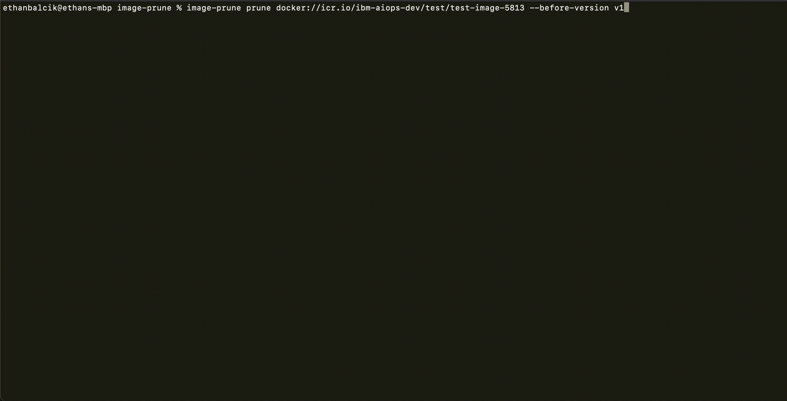

# image-prune

A command-line interface for pruning container images in bulk from a container image distribution registry

**Install**: See [the Install section below](#install)

**Usage**: See [doc/usage.md](doc/usage.md)

> [!WARNING]
> Please be aware of this known issue.
> - [Skopeo delete command deletes by reference even when we provide tag](https://github.com/containers/skopeo/issues/1432)
>
> The `image-prune` CLI is built on the same foundational library as `skopeo`, and thus is impacted by this issue as well.  Please use this tool at your own risk.

## Demo



For more demos, see [doc/usage.md](./doc/usage.md)

## Install

### Pre-compiled release

For each release of `image-prune`, we publish pre-compiled builds of the `image-prune` CLI.

#### Install script

For convenience, you may use our [install script](install.sh) to download and install the latest pre-compiled `image-prune` CLI.
```
Usage:
  <sh | bash> install.sh <version> [os] [arch]

Example:
  sh install.sh v1.0.0-alpha.1 linux amd64
```

This assumes
- You are running on a unix-like system supporting `sh` or `bash`
- The `/usr/local/bin` subdirectory exists, and is on your `PATH`
- You have `curl` and `jq` installed
- You have a GitHub personal access token which expires no more than one year from now
- (Optional) You have `go` installed, in which case you may omit the `[os]` and `[arch]` optional positional args above

#### Manual

Each of our releases contain pre-compiled binaries which you may install manually if the install script is not suitable for your use case
- https://github.com/IBM/image-prune/releases

### Build from source

#### Using `go install`

If you have `go` installed, you may also install the CLI using
```
GOBIN="/usr/local/bin" go install github.com/IBM/image-prune/cmd@v1.0.0-alpha.1
```

> [!NOTE]
> This will build the `image-prune` CLI from source on your machine, and may lead to unexpected results when using the `image-prune version` subcommand.

#### Using `go build`

Clone this repository on the tag corresponding to the version you would like to install.  The latest is `v1.0.0-alpha.1`.  Run
```bash
YOUR_OS="<your-os>"
YOUR_ARCH="<your-arch>"
make build PLATFORMS="$YOUR_OS/$YOUR_ARCH"
mv ./dist/image-prune-${YOUR_OS}-${YOUR_ARCH} /usr/local/bin/image-prune
```
