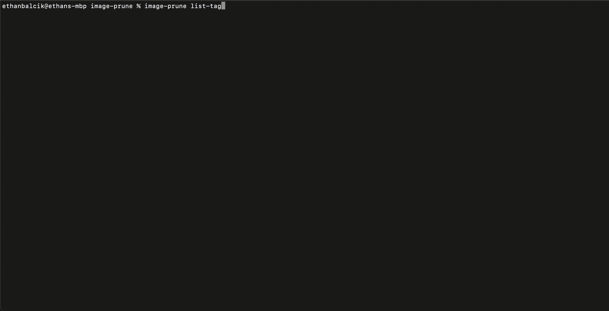
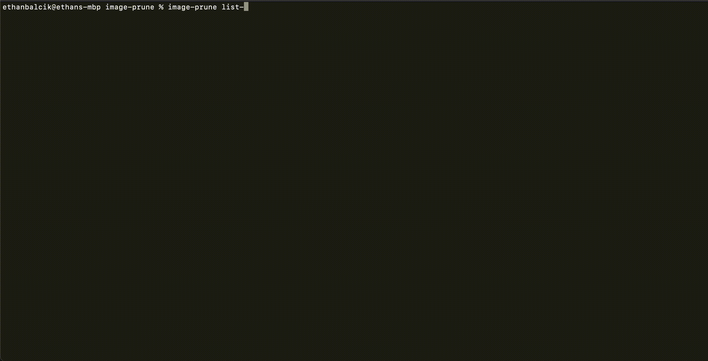
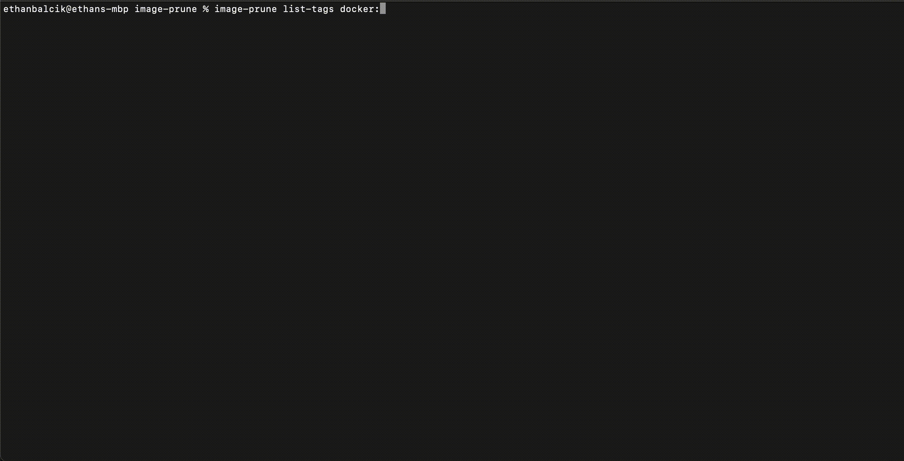
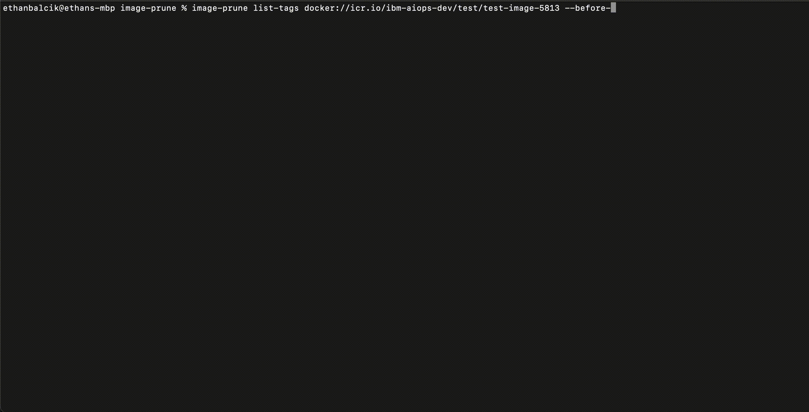
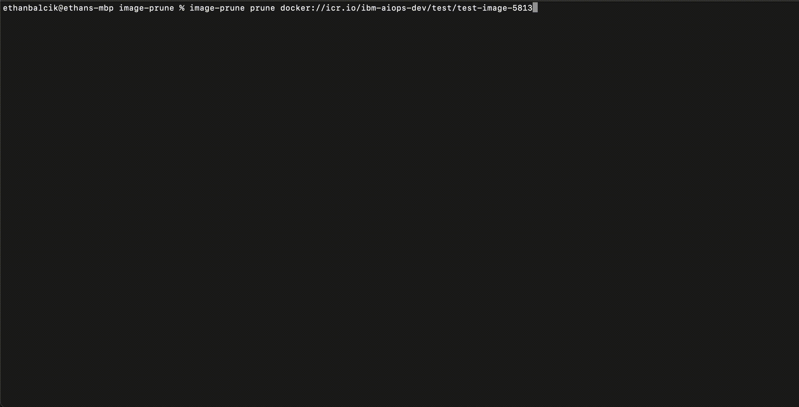
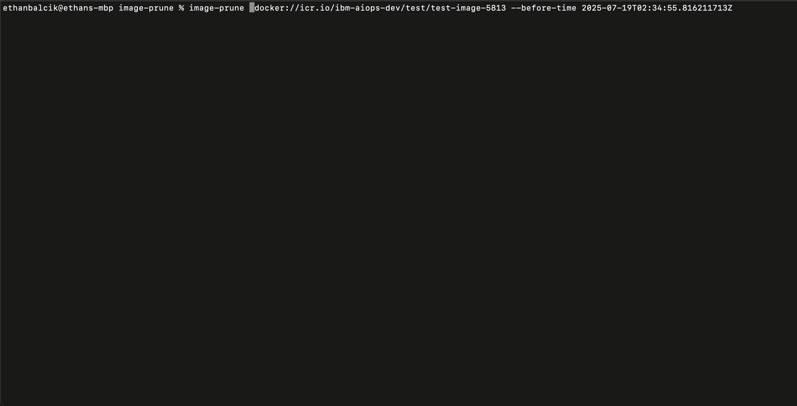

# Demos

> Demos of the `image-prune` CLI

## Contents

- [List Tags](#list-tags)
    - [Default](#default)
    - [Before version (using tag)](#before-version-using-tag)
    - [Before version (using label)](#before-version-using-label)
    - [Before time](#before-time)
- [Prune](#prune)
    - [Before version (using tag)](#before-version-using-tag-1)
    - [Before version (using label)](#before-version-using-label-1)
    - [Before time](#before-time-1)

## List tags

### Default

### Before version (using tag)

### Before version (using label)

### Before time

## Prune

### Before version (using tag)

### Before version (using label)

### Before time

