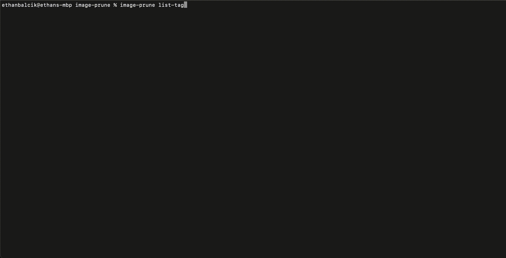
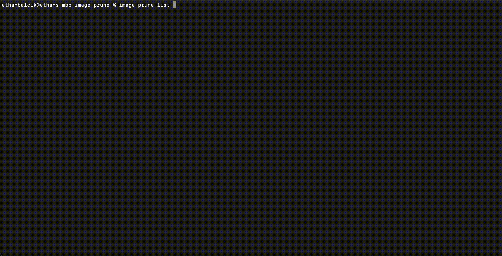
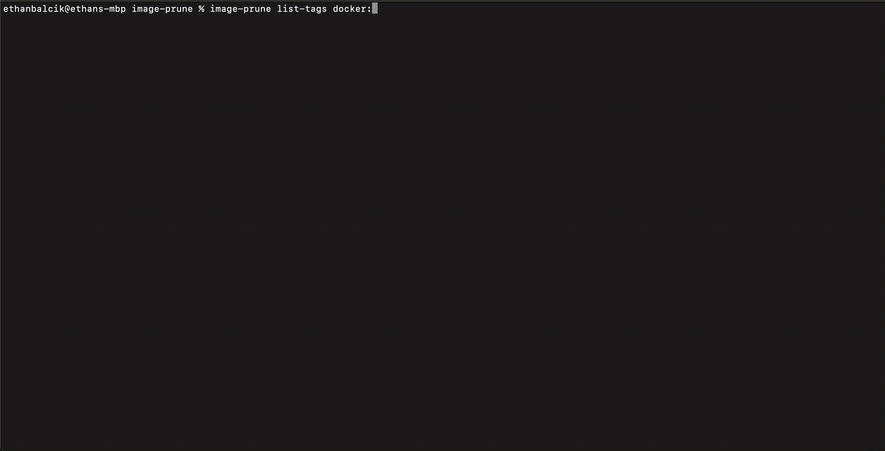
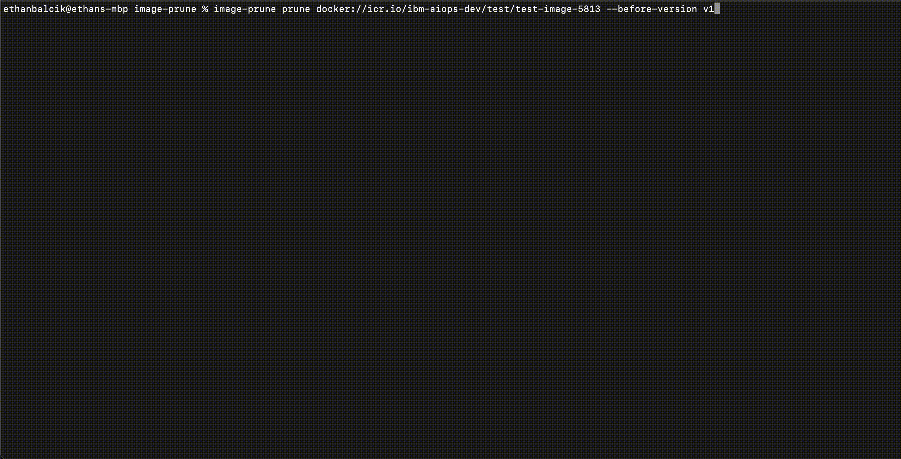
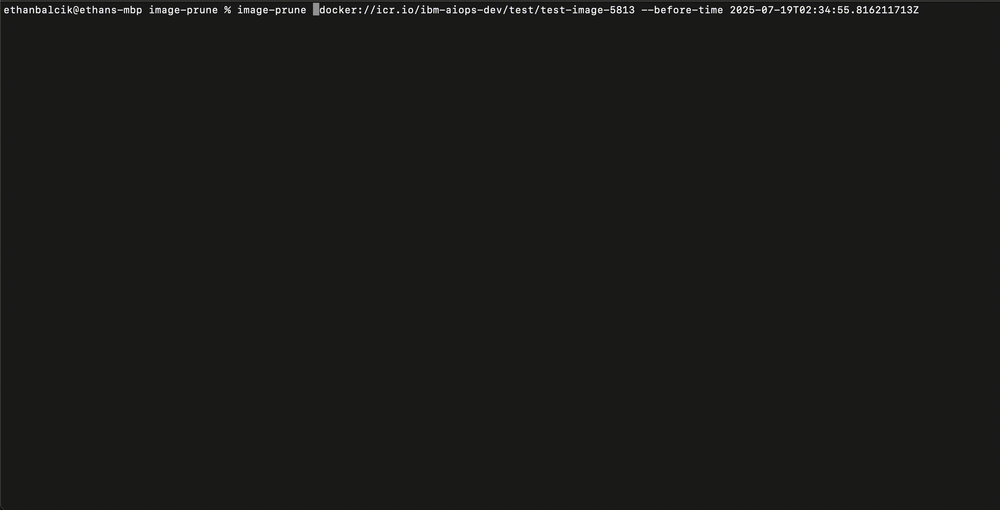

# Usage

> Usage of the `image-prune` CLI, along with recorded demos

## Contents

- [List Tags](#list-tags)
    - [Default](#default)
    - [Before version (using tag)](#before-version-using-tag)
    - [Before version (using label)](#before-version-using-label)
    - [Before time](#before-time)
- [Prune](#prune)
    - [Before version (using tag)](#before-version-using-tag-1)
    - [Before version (using label)](#before-version-using-label-1)
    - [Before time](#before-time-1)

## List tags

> Use `image-prune list-tags` to list the set of image tags which would be pruned by `image-prune prune`

### Default

To list **all image tags**, use the following command which is equivalent to `skopeo list-tags`
```
image-prune list-tags docker://<image>
```



### Before version (using tag)

To filter image tags by **version** ([SemVer](https://semver.org/)) derived from the **image tag**, use the following
```
image-prune list-tags docker://<image> --before-version <semver>
```

Adding the `--invalid` flag will include tags with invalid SemVer in the output.



### Before version (using label)

If your image tagging does not strictly follow SemVer, you may also derive the version **from an image label** like so
```
image-prune list-tags docker://<image> --before-version <semver> --version-label <label>
```

This will add time (and a significant number of HTTP requests) to the command as it requires each tag to be inspected individually.

Adding the `--invalid` flag will include the tags whose version label contained invalid SemVer in the output.



### Before time

To filter image tags by **created date**, use the following
```
image-prune list-tags docker://<image> --before-time <rfc-3339-timestamp>
```

This also requires each tag to be inspected individually, and thus will add time & network traffic to the command execution.


## Prune

> Use `image-prune prune` to prune image tags prior to a given version or created date

Note the existence of the following flags which apply to all of the following scenarios:
- `-y` / `--non-interactive`: Do not prompt for user-input before pruning.  This is good for automated scripts but proceed with caution when using this.
- `-s` / `--skip-summary`: Do not calculate the storage space freed by pruning.  This eliminates additional time and HTTP traffic issued by the command at the expense of not calculating the freed storage space by pruning.

### Before version (using tag)

To prune images by **version** ([SemVer](https://semver.org/)) derived from the **image tag**, use the following
```
image-prune prune docker://<image> --before-version <semver>
```

Adding the `--invalid` flag will also prune tags with invalid SemVer in the output.



### Before version (using label)

If your image tagging does not strictly follow SemVer, you may also derive the version **from an image label** like so
```
image-prune list-tags docker://<image> --before-version <semver> --version-label <label>
```

This will add time (and a significant number of HTTP requests) to the command as it requires each tag to be inspected individually.

Adding the `--invalid` flag will also prune the tags whose version label contained invalid SemVer in the output.


### Before time

To filter image tags by **created date**, use the following
```
image-prune list-tags docker://<image> --before-time <rfc-3339-timestamp>
```

This also requires each tag to be inspected individually, and thus will add time & network traffic to the command execution.


